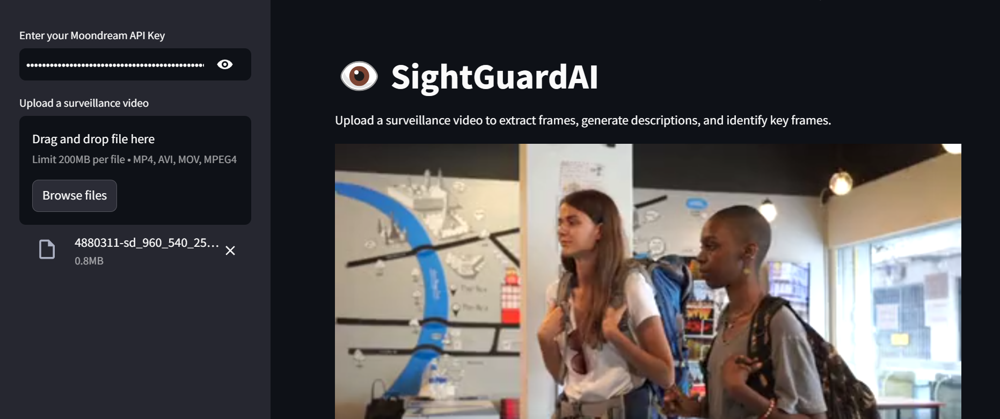

# 👁️ SightGuardAI

An intelligent surveillance analysis tool that automatically detects and describes key events in video footage using Moondream Vision AI.

## 🌟 Features

* 🎬 Smart frame extraction from surveillance videos
* 🤖 AI-powered scene description generation
* 🎯 Intelligent key frame detection using similarity analysis
* 📊 Comprehensive data visualization with interactive tables
* ⌚ Precise timestamp tracking
* 📈 Frame-by-frame similarity comparison
* 🔄 Support for multiple video formats (MP4, AVI, MOV)
* 📱 Clean, responsive web interface

## 🖼️ Demo




## 🔧 Prerequisites

* Python 3.11 or higher
* Web Browser
* Moondream API key from [Moondream Console](https://console.moondream.ai) or download the model file from [here](https://docs.moondream.ai/specifications)

## 📥 Installation

1. Clone the repository:
```bash
git clone https://github.com/smaranjitghose/sightguardai.git
cd sightguardai
```

2. Create and activate virtual environment:
```bash
# Windows
python -m venv env
.\env\Scripts\activate

# Linux/Mac
python3 -m venv env
source env/bin/activate
```

3. Install required packages:
```bash
pip install streamlit moondream python-dotenv pillow opencv-python scikit-learn pandas
```

## 💡 Usage

1. Launch the application:
```bash
streamlit run app.py
```

2. Access the web interface:
```
http://localhost:8501
```

3. Enter your Moondream API key in the sidebar
4. Upload a surveillance video file
5. Click "Analyze" to begin processing
6. View results in the interactive table and key frames grid

## 🛠️ Troubleshooting

1. **Memory Issues**
   * Adjust frame extraction interval for longer videos
   * Ensure sufficient system RAM
   * Close other memory-intensive applications

2. **API Errors**
   * Verify API key validity
   * Check internet connection
   * Confirm API usage limits

3. **Video Processing**
   * Ensure video format compatibility
   * Check file corruption
   * Verify file permissions

## 🤝 Contributing

Contributions are welcome! Please follow these steps:

1. Fork the project
2. Create your feature branch (`git checkout -b feature/AmazingFeature`)
3. Commit your changes (`git commit -m 'Add some AmazingFeature'`)
4. Push to the branch (`git push origin feature/AmazingFeature`)
5. Open a Pull Request

## 📝 License

This project is licensed under the MIT License - see the [LICENSE](LICENSE) file for details.

---
Made with ❤️ by [Smaranjit Ghose](https://github.com/smaranjitghose)